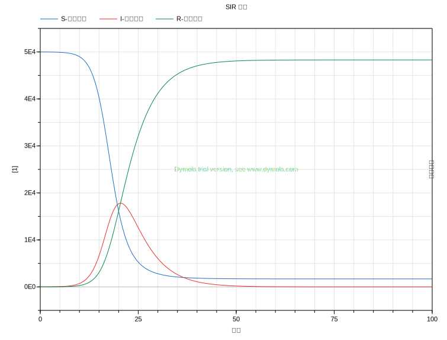

# 病毒传播数学模型

---
`数学模型`:用数学语言描述一些具有规律性或常识性的现象

---

# 显而易见
- `现象1`: 病毒携带者人数越多，感染的速率就越快。
- `现象2`: 易感人群的人口基数越大，单个病毒携带者的感染能力越强。
- `现象3`: 由于人类自身免疫力，医学的进步和科学的治疗，被感染的人中总有一定比例会被治愈。

---

---

- `现象3`:每天都有一部分感染人群$I$以一个恒定的比例$\gamma$转变为康复人群$R$。

---
$\dot{R}=\gamma I$

- $I$: 感染人群数量
- $\gamma$: 康复率($\gamma>=0$) recovery rate
- $R$: 康复人群数量
- $\dot{R}$: 康复人群数量增长率

---

- `现象1`: 病毒携带者数量（感染人群）越大，感染的速度就越快 $\dot{S}\propto I$
- `现象2`: 易感人群数量越大，单个病毒携带者能感染的速度就越快 $\dot{S}\propto S$

---
$\dot{S}=-\beta SI$

- $I$: 感染人群数量
- $\beta$: 传染率($\beta>=0$) infection/transmission rate
- $S$: 易感人群数量
- $\dot{S}$: 易感人群数量下降率
- 负号: 易感人群数量是`减少`的

---

- 前面已知易感人群的下降率$\dot{S}$，又已知康复人群的增长率$\dot{R}$，那么`感染人群`的变化率$\dot{I}$则为这二者之和。

---
$\dot{I}= \beta SI - \gamma I = (\beta S - \gamma)I$

- $I$: 感染人群数量
- $\beta$: 传染率
- $\gamma$: 康复率
- $S$: 易感人群数量
- $R$: 康复人群数量

---
# 经典 SIR 模型
$\dot{S}=-\beta SI$
$\dot{I}= \beta SI - \gamma I$
$\dot{R}=\gamma I$

- [Kermack-McKendrick Theory 1927](https://en.wikipedia.org/wiki/Kermack%E2%80%93McKendrick_theory)
- [Sir Ronald Ross 1902 诺贝尔生理学或医学奖](https://en.wikipedia.org/wiki/Ronald_Ross)
- 被用于Ebola，疟疾，HIV，流感等传染病动力学的建模。
- 易于扩展

---

- $\beta=1.4\times 10^{-5}, \gamma=0.2, R_e=3.5$
- $N=50000,I(0)=1$

---
`非常识性结论`:
疫情拐点会出现在$S(t)=\frac{\gamma}{\beta}$处
通过该点后感染人数$I$就会下降

---
$\dot{I}= (\beta S - \gamma)I = (\frac{\beta}{\gamma} S - 1)\gamma I$

---
$R_e = S(0)\frac{\beta}{\gamma}$ - 有效繁殖数
- 当$R_e \leq 1$时，$I(t)$会随着时间推移递减至$0$。
- 当$R_e > 1$时，$I(t)$会先增加，并达到其峰值，最后递减至$0$。

---
## 其他结论
- 感染人数存在极大值。
- 病毒不会以“清空”所有易感人群$S$的方式结束 $S(\infty)>S(0) e^{−\beta/\gamma}$
- 可以预测疫情大小，疫情结束时间等。

---
#### 公共卫生政策解读
$R_e = S(0)\frac{\beta}{\gamma}$ - 有效繁殖数
- 降低$\beta$: 隔离，洗手，戴口罩。
- 增大$\gamma$: 抗病毒药物研制，建医院，增加医护人员。
- 降低$S(0)$: 打疫苗。